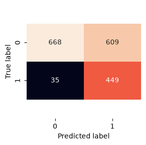

# 📉 Telco Customer Churn Prediction

An end-to-end supervised machine learning project that predicts whether a telecom customer is likely to churn (cancel their subscription). This project demonstrates the complete supervised machine learning workflow, from exploratory data analysis and data preprocessing to model selection, hyperparameter tuning, and business-oriented threshold optimization.

> **Goal:** Predict customer churn to help telecom companies identify customers at risk and enable proactive retention strategies.

---

## 🚀 Tech Stack

* **Language:** Python
* **Data Analysis:** Pandas, NumPy
* **Machine Learning:** Scikit-learn
* **Visualization:** Matplotlib, Seaborn

---

## 📁 Project Structure

```text
.
├── data/
│   └── Telco-Customer-Churn.csv
├── images/
│   ├── F1_Evaluation_matrix.png
│   └── Confusion_matrix.png
├── telecom.ipynb
|── README.md
|__ LICENSE
```

---

## 📊 Dataset

**Telco Customer Churn Dataset**

* **Source:** Kaggle
* **Samples:** 7,043 customers
* **Features:** 21 customer attributes
* **Target:** `Churn` (Yes / No)

The dataset contains customer demographics, account information, subscribed services, and billing details used to predict whether a customer is likely to churn.

---

## 🔄 Workflow

The notebook follows a complete supervised machine learning pipeline:

1. Data Loading
2. Exploratory Data Analysis (EDA)
3. Data Cleaning
4. Outlier Detection
5. Data Preprocessing
6. Model Training
7. Hyperparameter Tuning
8. Model Comparison
9. Decision Threshold Optimization
10. Final Evaluation

---

## ✨ Key Features

* Performed Exploratory Data Analysis (EDA) to understand customer behavior and assess data quality.
* Cleaned and prepared the dataset by handling missing values, correcting data types, and encoding the target variable.
* Built a preprocessing pipeline using **ColumnTransformer** and **Pipeline** to prevent data leakage.
* Compared multiple supervised learning models using **RandomizedSearchCV** with 5-fold cross-validation.
* Reduced overfitting through hyperparameter tuning.
* Evaluated model performance using Precision, Recall, F1-score, and Confusion Matrix.
* Explored decision threshold optimization to demonstrate the tradeoff between recall and false positives in real-world business scenarios.

---

## 📈 Results

| Model               |     CV F1 |   Test F1 |
| ------------------- | --------: | --------: |
| **Logistic Regression**   | **0.627** | **0.642** |
| Random Forest |     0.631 |     0.640 |
| SVC                 |     0.618 |     0.628 |
| KNN                 |     0.553 |     0.562 |

### Best Model

* **Model:** Logistic Regression
* **Cross-validation F1-score:** **62.7%**
* **Test F1-score:** **64.2%**

The close cross-validation and test F1-scores suggest that the Logistic Regression model generalizes well and exhibits limited overfitting after hyperparameter tuning.

<p align="center">
  
</p>

<p align="center">
  
</p

---

## 💡 Business Insight

The dataset is moderately imbalanced (approximately **73% non-churn** and **27% churn**), making accuracy alone an insufficient evaluation metric.

By lowering the classification threshold from **0.5** to **0.3**, churn recall increased from **45.7%** to **93.7%**. This demonstrates the practical tradeoff between identifying more customers who are likely to churn and increasing the number of false positives. The results highlight that the optimal decision threshold should be selected based on business objectives rather than relying on the default threshold.

---

## ▶️ Running the Project

### Clone the repository

```bash
git clone <your-repository-url>
cd Telco_Customer_Churn
```

### Install dependencies

```bash
pip install -r requirements.txt
```

### Launch the notebook

```bash
jupyter notebook
```

Open

```text
telecom.ipynb
```

and run all cells.

---

## 📚 Learning Outcomes

Through this project, I strengthened my understanding of:

* Exploratory Data Analysis (EDA)
* Data preprocessing
* Scikit-learn Pipelines
* ColumnTransformer
* Hyperparameter tuning
* Cross-validation
* Model comparison
* Overfitting mitigation
* Model evaluation
* Decision threshold optimization
* Applying supervised machine learning to solve real-world business problems

---

## 📖 Dataset Source

**Telco Customer Churn Dataset**

https://www.kaggle.com/datasets/blastchar/telco-customer-churn
