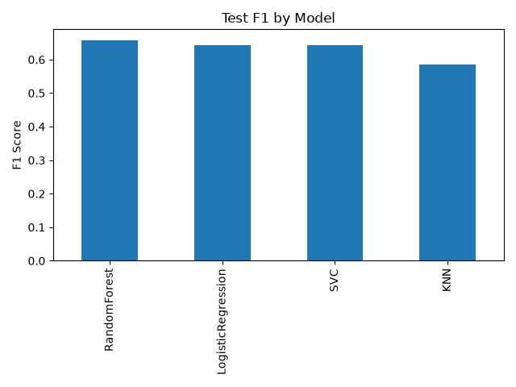

# 📉 Telco Customer Churn Prediction

An end-to-end supervised machine learning project that predicts whether a telecom customer is likely to churn (cancel their subscription). This project demonstrates the complete machine learning workflow, from exploratory data analysis and data preprocessing to model comparison, overfitting mitigation, and business-oriented threshold optimization.

> **Goal:** Help telecom companies identify customers at risk of churning so proactive retention strategies can be applied.

---

## 🚀 Tech Stack

- **Language:** Python
- **Data Analysis:** Pandas, NumPy
- **Machine Learning:** Scikit-learn
- **Visualization:** Matplotlib, Seaborn

---

## 📁 Project Structure

```text
.
├── data/
│   └── Telco-Customer-Churn.csv
├── images/
│   ├── workflow.png
│   ├── model_comparison.png
│   └── confusion_matrix.png
├── telecom.ipynb
└── README.md
```

---

## 📊 Dataset

**Telco Customer Churn Dataset**

- **Source:** Kaggle
- **Samples:** 7,043 customers
- **Features:** 21 customer attributes
- **Target:** `Churn` (Yes / No)

The dataset contains customer demographics, account information, subscribed services, and billing details used to predict customer churn.

---

## 🔄 Workflow

The notebook follows the complete supervised machine learning pipeline:

1. Data Loading
2. Exploratory Data Analysis (EDA)
3. Data Cleaning
4. Outlier Detection
5. Preprocessing Pipeline
6. Model Training
7. Hyperparameter Tuning
8. Model Comparison
9. Threshold Optimization
10. Final Evaluation

---

## ✨ Key Features

- Performed Exploratory Data Analysis (EDA) to understand customer behavior and data quality.
- Cleaned and prepared the dataset by handling missing values, correcting data types, and encoding the target variable.
- Built a leak-free preprocessing pipeline using **ColumnTransformer** and **Pipeline**.
- Compared multiple supervised learning models using **RandomizedSearchCV** with 5-fold cross-validation.
- Diagnosed and mitigated overfitting through hyperparameter tuning.
- Evaluated model performance using Accuracy, Precision, Recall, F1-score, and Confusion Matrix.
- Explored decision threshold optimization to demonstrate real-world business tradeoffs.

---

## 📈 Results

| Model | Test F1 |
|--------|---------:|
| **RandomForest** | **0.643** |
| SVC | 0.643 |
| Logistic Regression | 0.657 |
| KNN | 0.586 |

### Best Model

- **Model:** RandomForest
- **Cross validation Accuracy:** 62.5%
- **Testing Accuracy:** 65.7%%

The close train and test scores indicate that overfitting was successfully mitigated after hyperparameter tuning.

<p align="center">
  
</p>

<p align="center">
  
</p>

---

## 💡 Business Insight

The dataset is moderately imbalanced (~73% non-churn vs. ~27% churn), making Accuracy alone an insufficient evaluation metric.

By lowering the classification threshold from **0.5** to **0.3**, churn recall increased from **45.7%** to **93.7%**, demonstrating the tradeoff between identifying more at-risk customers and generating additional false positives. This highlights that threshold selection should ultimately be driven by business objectives rather than default model settings.

---

## 🔮 Future Improvements

- Gradient Boosting models (XGBoost / LightGBM)
- SMOTE for class balancing experiments
- ROC-AUC and Precision-Recall analysis

---

## ▶️ Running the Project

### Clone the repository

```bash
git clone <your-repository-url>
cd Telco_Customer_Churn
```

### Install dependencies

```bash
pip install -r requirements.txt
```

### Launch the notebook

```bash
jupyter notebook
```

Open:

```text
telecom.ipynb
```

and run all cells.

---

## 📚 Learning Outcomes

Through this project, I strengthened my understanding of:

- Exploratory Data Analysis (EDA)
- Data preprocessing
- Scikit-learn Pipelines
- ColumnTransformer
- Hyperparameter tuning
- Cross-validation
- Overfitting diagnosis
- Model evaluation
- Threshold optimization
- Applying machine learning to real-world business problems

---

## 📖 Dataset Source

**Telco Customer Churn Dataset**

https://www.kaggle.com/datasets/blastchar/telco-customer-churn